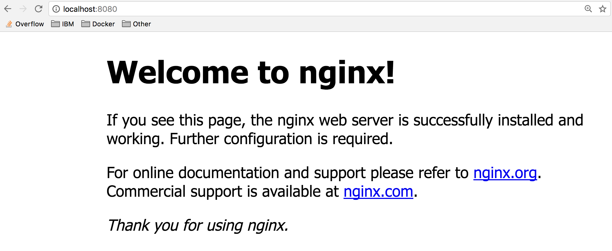
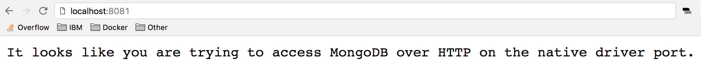

# Lab 1 - 初めてのコンテナを実行する

コンテナとは、分離された状態で実行されるプロセス (またはプロセスのグループ) に過ぎません。分離された状態は Linux 名前空間 (namespace) と制御グループ (control group) によって実現されます。Linux 名前空間と制御グループは Linux カーネルに組み込まれている機能である点に注意してください。Linux カーネル自体を除けば、コンテナに特殊なところは何もありません。

コンテナが役立つ理由は、コンテナを中心に開発されたツールにあります。コンテナを使用してアプリケーションを構築する際のツールとして事実上の標準となっているのが、このコースのラボで使用する Docker です。Docker には、開発者やオペレーターがあらゆる環境で容易にコンテナを作成、配布、実行できるよう、ユーザー・フレンドリーなインターフェースが用意されています。

## Lab 1 の概要

このラボの最初の部分では初めてのコンテナを実行し、コンテナを調べる方法を学びます。コンテナを調べると、Linux カーネルの名前空間によってコンテナが分離されていることを確認できます。

初めてのコンテナを実行した後は、Docker コンテナのさまざまな使い方を探ります。Docker Hub に用意されている多数のサンプル・コンテナのうち、何種類かのコンテナを同じホスト上で実行します。こうすることで、分離によってもたらされるメリット、つまり同じホスト上で複数のコンテナを実行しても競合が発生しないことを確認できます。

このラボで使用する Docker コマンドは少数に限られています。使用できるコマンドについて詳しくは、[公式のドキュメント](http://docs.docker.jp/)を参照してください。

## 前提条件

Lab0 を完了して、Docker がインストール済みになっているか、http://play-with-docker.com を使用できる状態になっていること。

> http://play-with-docker.com を使用する場合は, `Login`,`Start`をクリック後、`+ ADD NEW INSTANCE`をクリックしてインスタンスを作成してから開始してください。

## ステップ 1: 初めてのコンテナを実行する

Docker CLI を使用して、最初のコンテナを実行します。

1. ローカル・コンピューター上で ターミナル (Windows はコマンドプロンプト) を開きます。

2. コマンド `docker container run -t ubuntu top` を実行します。

コマンド `docker container run` を使用して、Ubuntu イメージから生成されたコンテナを実行します。ここでは、`top` コマンドを使用しているので、`-t` フラグで疑似 TTY を割り当てる必要があります。

```sh
$ docker container run -it ubuntu top
Unable to find image 'ubuntu:latest' locally
latest: Pulling from library/ubuntu
aafe6b5e13de: Pull complete
0a2b43a72660: Pull complete
18bdd1e546d2: Pull complete
8198342c3e05: Pull complete
f56970a44fd4: Pull complete
Digest: sha256:f3a61450ae43896c4332bda5e78b453f4a93179045f20c8181043b26b5e79028
Status: Downloaded newer image for ubuntu:latest
```

`docker run` コマンドにより、最初に `docker pull` が実行されて Ubuntu イメージがホストにダウンロードされ、コンテナが起動されます。実行中のコンテナからは、次のような出力が生成されます。

```sh
top - 20:32:46 up 3 days, 17:40,  0 users,  load average: 0.00, 0.01, 0.00
Tasks:   1 total,   1 running,   0 sleeping,   0 stopped,   0 zombie
%Cpu(s): 0.0 us,  0.1 sy,  0.0 ni, 99.9 id,  0.0 wa,  0.0 hi,  0.0 si,  0.0 st
KiB Mem :  2046768 total,   173308 free,   117248 used,  1756212 buff/cache
KiB Swap:  1048572 total,  1048572 free,        0 used.1548356 avail Mem

  PID USER      PR  NI    VIRT    RES    SHR S  %CPU %MEM     TIME+ COMMAND
    1 root      20   0   36636   3072   2640 R   0.3  0.2   0:00.04 top
```

`top` は、システム上のプロセスをリソース使用率の順に出力する Linux ユーティリティーです。上記の出力には、プロセスとして `top` プロセス自体しか示されていません。ホストの他のプロセスがこのリストに示されていないのは、PID 名前空間で分離されているためです。

コンテナは Linux 名前空間を使用してシステム・リソースを他のコンテナやホストから分離します。PID 名前空間により、プロセス ID が分離されます。コンテナ内部で `top` を実行すると、ホストに対して `top` を実行したときとはまったく異なり、コンテナの PID 名前空間内にある複数のプロセスが出力に示されるはずです。

> ここでは `ubuntu` イメージを使用していますが、このコンテナ専用のカーネルはないことに注意してください。コンテナはホストのカーネルを使用します。`ubuntu` イメージは、Ubuntu システム上で使用可能なファイル・システムとツールを提供するためだけに使用されています。

3. `docker container exec` を使用してコンテナを調べます。

`docker container exec` コマンドは、新しいプロセスによって実行中コンテナの名前空間に「侵入」する手段です。

新しいターミナルを開きます。play-with-docker.com を使用している場合、node1 に接続された新しいターミナルを開くには、左側にある「Add New Instance (新規インスタンスの追加)」をクリックし、node1 に示されている IP を使用して、node2 から node1 に SSH で接続します。以下に例を示します。

```sh
[node2] (local) root@192.168.0.17 ~
$ ssh 192.168.0.18
[node1] (local) root@192.168.0.18 ~
$
```

先ほど作成して実行中になっているコンテナの ID を取得するために、新しいターミナルで `docker container ls` コマンドを実行します。

```sh
$ docker container ls
CONTAINER ID        IMAGE                      COMMAND                  CREATED             STATUS                         PORTS                       NAMES
b3ad2a23fab3        ubuntu                     "top"                    29 minutes ago      Up 29 minutes                                              goofy_nobel
```

取得した ID を指定して `docker container exec` コマンドを実行することで、コンテナ内部で `bash` を実行します。bash を使用してターミナルからコンテナとやり取りするため、`-it` フラグを使用します。このフラグにより、疑似ターミナルを割り当てている間は、対話モードを使用して bash を実行できます。

```sh
$ docker container exec -it b3ad2a23fab3 bash
root@b3ad2a23fab3:/#
```

成功です！`docker container exec` コマンドを使用して、bash プロセスでコンテナの名前空間に「侵入」できました。Docker コンテナを調べる際は、`docker container exec` で `bash` を使用するのが共通パターンとなっています。

ターミナルのプレフィックスが `root@b3ad2a23fab3:/` のように変更されていることに注目してください。これが、コンテナ内で bash を実行していることを示す指標となります。

> **注**: bash プロセスを使用して接続するということは、別個のホストや VM に SSH を使用して接続することとは異なります。bash プロセスで接続する場合、SSH サーバーは必要ありません。コンテナはカーネル・レベルの機能を使用して分離を実現すること、コンテナはカーネルをベースに実行されることを念頭に置いてください。このコンテナは同じホスト上で分離されて実行されるプロセスのグループに過ぎません。したがって、この分離されたグループ内に `bash` プロセスで侵入するには、`docker container exec` を使用できます。`docker container exec` を実行した後は、分離されて実行されるプロセスのグループに `top` と `bash` が加わります。

同じターミナルから `ps -ef` を実行して、実行中のプロセスを調べましょう。
```sh
root@b3ad2a23fab3:/# ps -ef
UID        PID  PPID  C STIME TTY          TIME CMD
root         1     0  0 20:34 ?        00:00:00 top
root        17     0  0 21:06 ?        00:00:00 bash
root        27    17  0 21:14 ?        00:00:00 ps -ef
```
上記を見るとわかるように、出力に示されるのは、`top` プロセス、`bash` プロセス、`ps` プロセスのみです。

比較のために、コンテナを終了してホスト上で `ps -ef` または `top` を実行します。これらのコマンドは、Linux 上でも Mac 上でも機能します。Windows の場合、実行中のプロセスを調べるには `tasklist` を使用します。

```sh
root@b3ad2a23fab3:/# exit
exit
$ ps -ef
# Lots of processes!
```

4. `top` プロセスを実行中のコンテナをクリーンアップするために、`<ctrl>-c` と入力します。

### 技術上の詳細

PID は、システム・リソースを分離するために使用できる Linux 名前空間の 1 つに過ぎません。他にも次の Linux 名前空間を使用できます。
- MNT - 他の名前空間に影響することなく、ディレクトリーをマウントまたはアンマウントします。
- NET - コンテナ独自のネットワーク・スタックを使用できます。
- IPC - プロセス間通知メカニズム (メッセージ・キューなど) を分離します。
- User -システム上のユーザー・ビューを分離します。
- UTC - コンテナごとにホスト名とドメイン名を設定します。

以上の名前空間を組み合わせて使用することで、コンテナのそれぞれを分離して安全に実行し、同じシステム上で実行されているコンテナ間の競合を回避することができます。次は、コンテナのさまざまな使い方と、同じホスト上で複数のコンテナを実行する際に分離がもたらすメリットについて説明します。

**注**: 名前空間は **Linux** カーネルの機能ですが、Docker を使用すると、Windows 上や Mac 上でもコンテナを実行できます。それが可能な理由は、Docker 製品には Linux サブシステムが埋め込まれているためです。Docker ではこの Linux サブシステムを [LinuxKit](https://github.com/linuxkit/linuxkit) という新しいプロジェクトとしてオープンソース化しました。さまざまなプラットフォーム上でコンテナを実行できることが、コンテナで Docker ツールを使用するメリットの 1 つです。

Linux サブシステムを使用して Windows 上で Linux コンテナを実行できるだけでなく、Windows OS に基づくコンテナ・プリミティブが作成されたことから、ネイティブ Windows コンテナを実行することも可能になっています。ネイティブ Windows コンテナは、Windows 10 または Windows Server 2016 以降で実行できます。

## ステップ 2: 複数のコンテナを実行する

1. Docker Hub サイト内を探索してみましょう。

[Docker Hub](https://hub.docker.com/) は、一般公開された Docker イメージの中央レジストリーです。ここで公開されているイメージは、誰もが共有できます。Docker Hub に格納されているコミュニティー・イメージと公式イメージは、[Docker Hub](https://hub.docker.com/explore/) 上で直接検索することもできます。

イメージを検索する際は、「Docker Cerified」「Verified Publisher」「Official Image」それぞれを対象としたフィルターがあります。これらのイメージに含まれるコンテンツは、Dockerまたは提供元によって検証され、セキュリティー上の脆弱性がすでにスキャンされたものです。さらに高度なイメージを見つけるには、「Docker Cerified」イメージを検索します。エンタープライズ対応と見なされるこれらのイメージは、Docker Enterprise Edition 製品でテストされています。

重要な点として、本番環境にデプロイする予定の独自のイメージを開発するときは、まだ検証済みでない Docker Hub のコンテンツは使用しないようにしてください。検証済みでないイメージには、セキュリティー上の脆弱性が伴っている可能性があります。さらに、悪意のあるソフトウェアである恐れもあります。

このラボのステップ 2 では、Docker Hub から入手できる検証済みのイメージを使用して、Nginx Web サーバーと Mongo データベースのコンテナをそれぞれ起動します。

2. Nginx サーバーを実行します。

Docker Store から入手できる[公式の Nginx イメージ](https://hub.docker.com/_/nginx)を使用してコンテナを実行しましょう。

```sh
$ docker container run --detach --publish 8080:80 --name nginx nginx
Unable to find image 'nginx:latest' locally
latest:Pulling from library/nginx
36a46ebd5019: Pull complete
57168433389f: Pull complete
332ec8285c50: Pull complete
Digest: sha256:c15f1fb8fd55c60c72f940a76da76a5fccce2fefa0dd9b17967b9e40b0355316
Status: Downloaded newer image for nginx:latest
5e1bf0e6b926bd73a66f98b3cbe23d04189c16a43d55dd46b8486359f6fdf048
```

上記ではいくつかの新しいフラグを使用しています。そのうちの 1 つ、`--detach` フラグは、このコンテナをバックグラウンドで実行するためのものです。`publish` フラグでは、コンテナをホスト上のポート 8080 を介してポート 80 (Nginx のデフォルト・ポート) で公開するように指定しています。前に説明したように、NET 名前空間を使用すると、コンテナ独自のネットワーク・スタックでプロセスを実行できます。`--publish` フラグは、コンテナを介してネットワークをホストに公開するために使用できる機能です。

Nginx のデフォルト・ポートがポート 80 であることがわかるのは、Docker Store 上の [ドキュメント](https://hub.docker.com/_/nginx) に記載されているためです。一般に、検証済みイメージに付随するドキュメントは非常に優れたものです。検証済みイメージを使用してコンテナを実行する際は、そのドキュメントを参照することをお勧めします。

上記では `--name` というフラグも指定しています。これは、コンテナの名前を指定するフラグです。すべてのコンテナには名前があります。名前を指定しなければ、Docker がランダムに名前を割り当てます。独自の名前を指定すれば、コマンドでコンテナの ID ではなく、その名前を参照できるため、コンテナに対する以降のコマンドを実行しやすくなります。例えば、`docker container inspect 5e1` ではなく `docker container inspect nginx` を使用できます。

Nginx コンテナを実行するのはこれが初めてなので、Docker Store から Nginx イメージがプルされます。これ以降、Nginx イメージを使用してコンテナを作成する際は、ホスト上の既存のイメージが使用されます。

Nginx は軽量の Web サーバーです。Nginx サーバーには、ローカル・ホスト上のポート 8080 上でアクセスできます。

3. Http://localhost:8080 上で Nginx サーバーにアクセスします。Play with Docker を使用している場合は、ページの上部にある `8080` リンクを探してください。



4. Mongo DB サーバーを実行します。

次は、MongoDB サーバーを実行します。この場合も、Docker Store から入手できる [公式の MongoDB イメージ](https://hub.docker.com/_/mongo) を使用します。ここでは `latest` タグ (タグを指定しない場合のデフォルト) を使用するのではなく、Mongo イメージの特定のバージョン 3.4 を使用します。
```sh
$ docker container run --detach --publish 8081:27017 --name mongo mongo:3.4
Unable to find image 'mongo:3.4' locally
3.4:Pulling from library/mongo
d13d02fa248d: Already exists
bc8e2652ce92: Pull complete
3cc856886986: Pull complete
c319e9ec4517: Pull complete
b4cbf8808f94: Pull complete
cb98a53e6676: Pull complete
f0485050cd8a: Pull complete
ac36cdc414b3: Pull complete
61814e3c487b: Pull complete
523a9f1da6b9: Pull complete
3b4beaef77a2: Pull complete
Digest: sha256:d13c897516e497e898c229e2467f4953314b63e48d4990d3215d876ef9d1fc7c
Status: Downloaded newer image for mongo:3.4
d8f614a4969fb1229f538e171850512f10f490cb1a96fca27e4aa89ac082eba5
```

この場合も、Mongo コンテナを実行するのは初めてのため、Docker Store から Mongo イメージをプルします。`--publish` フラグを使用して、Mongo 用のポートとしてホスト上のポート 27017 を公開します。ホスト上のポート 8080 はすでに公開されているため、ホストのマッピングには 8080 以外のポートを使用する必要があります。Mongo イメージを使用する方法についても、[公式ドキュメント](https://hub.docker.com/_/mongo) で詳細を確認してください。

5. http://localhost:8081 にアクセスして、Mongo からの出力を確認します。Play with Docker を使用している場合は、ページの上部にある `8080` リンクを探してください。



6. `docker container ls` を使用して、実行中のコンテナを確認します。

```sh
$ docker container ls
CONTAINER ID        IMAGE               COMMAND                  CREATED                  STATUS              PORTS                     NAMES
d6777df89fea        nginx               "nginx -g 'daemon ..."   Less than a second ago   Up 2 seconds        0.0.0.0:8080->80/tcp      nginx
ead80a0db505        mongo               "docker-entrypoint..."   17 seconds ago           Up 19 seconds       0.0.0.0:8081->27017/tcp   mongo
af549dccd5cf        ubuntu              "top"                    5 minutes ago            Up 5 minutes                                  priceless_kepler
```

Nginx Web サーバー・コンテナと MongoDB コンテナがホスト上で実行されていることを確認できるはずです。これらのコンテナはまだ互いに対話するようには構成していません。

上記の出力には、コンテナのそれぞれに指定した「nginx」と「mongo」という名前の他に、Ubuntu コンテナに生成されたランダムな名前 (この例では「priceless_kepler」) が示されています。また、`--publish` フラグで指定したポート・マッピングも確認できます。これらの実行中のコンテナの詳細について調べるには、`docker container inspect [コンテナ ID]` コマンドを使用します。

### 技術上の詳細

お気付きかもしれませんが、Mongo コンテナは `docker-entrypoint` というコマンドを実行しています。これは、コンテナの起動時に実行される実行可能ファイルの名前です。Mongo イメージを使用するには、DB プロセスを開始する前にあらかじめ構成を行う必要があります。スクリプトの正確な処理内容を確認するには、[github](https://github.com/docker-library/mongo/blob/master/3.4/docker-entrypoint.sh) 上に置かれているスクリプトを調べてください。一般に、github ソースへのリンクは、Docker Hub Web サイト上のイメージの説明ページで見つかります。

コンテナは自己完結型であり、分離されています。つまり、異なるシステムやランタイムへの依存関係を持つコンテナ間で発生する可能性のある競合を回避することができます。例えば、Java 7 を使用するアプリと Java 8 を使用する別のアプリを同じホスト上にデプロイする場合でも競合は発生しません。また、デフォルトのリスニング・ポートとして共通してポート 80 を使用する複数の Nginx コンテナを実行するとしても (`--publish` フラグを使用してホスト上で公開される場合、ホストで選択されているそれぞれのポートは一意でなければなりません)、競合を回避できます。分離によるこのようなメリットは、Linux 名前空間によってもたらされます。

**注**: 以上のプロセスを実行するためにホスト上にインストールしなければならないものは (Docker の他に) 1 つもありませんでした！各コンテナに必要な依存関係はそのコンテナに組み込まれるため、依存関係をホストに直接インストールする必要はまったくありません。

同じホスト上で複数のコンテナを実行すれば、単一のホスト上で利用可能なリソース (CPU、メモリーなど) をフル活用できます。したがって、企業にとって大幅なコスト削減につながります。

Docker Store のイメージをそのまま実行すると便利な場合もありますが、カスタム・イメージを作成するほうが役立ちます。カスタム・イメージの出発点としては、公式イメージを参照できます。独自のカスタム・イメージを作成する方法については、ラボ 2 で詳しく説明します。

## ステップ 3: クリーンアップ

このラボの手順に従うと、最終的にはホスト上で一連のコンテナが実行されることになります。これらのコンテナをクリーンアップしましょう。

1. まず、`docker container ls` を使用して、実行中のコンテナのリストを取得します。

```sh
$ docker container ls
CONTAINER ID        IMAGE               COMMAND                  CREATED             STATUS              PORTS                     NAMES
d6777df89fea        nginx               "nginx -g 'daemon ..."   3 minutes ago       Up 3 minutes        0.0.0.0:8080->80/tcp      nginx
ead80a0db505        mongo               "docker-entrypoint..."   3 minutes ago       Up 3 minutes        0.0.0.0:8081->27017/tcp   mongo
af549dccd5cf        ubuntu              "top"                    8 minutes ago       Up 8 minutes                                  priceless_kepler
```
2. 次に、リストに含まれているコンテナごとに `docker container stop [コンテナ ID]` を実行します。コンテナ ID ではなく、コンテナに指定した名前を使用することもできます。
```sh
$ docker container stop d67 ead af5
d67
ead
af5
```

**注**: 参照する必要がある ID は、一意になるだけの桁数があれば十分です。ほとんどの場合は、3 桁の数字があれば一意の ID になります。

2. 停止したコンテナを削除します。

システムをクリーンアップするには、`docker system prune` コマンドが大いに重宝します。このコマンドは、停止されているコンテナ、未使用のボリュームとネットワーク、孤立したイメージのすべてを削除します。

```sh
$ docker system prune
WARNING!This will remove:
        - all stopped containers
        - all volumes not used by at least one container
        - all networks not used by at least one container
        - all dangling images
Are you sure you want to continue?[y/N] y
Deleted Containers:
7872fd96ea4695795c41150a06067d605f69702dbcb9ce49492c9029f0e1b44b
60abd5ee65b1e2732ddc02b971a86e22de1c1c446dab165462a08b037ef7835c
31617fdd8e5f584c51ce182757e24a1c9620257027665c20be75aa3ab6591740

Total reclaimed space: 12B
```

## まとめ

このラボでは、Ubuntu、Nginx、MongoDB の各コンテナを初めて作成しました。

このラボで学んだ重要な点
- コンテナを構成する Linux 名前空間と制御グループにより、コンテナは他のコンテナやホストから分離されます。
- コンテナは分離されます。この特性により、依存関係の競合を懸念することなく、単一のホスト上で複数のコンテナをスケジューリングできます。したがって、単一のホスト上で複数のコンテナを実行し、そのホストに割り当てられているリソースを簡単にフル活用できるため、最終的にはサーバーにかかる費用を節約できます。
- 独自のイメージを開発する際は、まだ検証されていない Docker Hub のコンテンツを使用しないようにしてください。未検証のイメージにはセキュリティー上の脆弱性が伴うことや、悪意のあるソフトウェアである恐れさえあります。
- コンテナ内でプロセスを実行するために必要なものはすべて、そのコンテナに含まれます。したがって、追加の依存関係をホストに直接インストールする必要は一切ありません。

次のハンズオンはこちら [Lab2](../lab-2/README.md) です。
