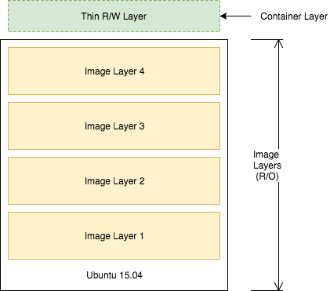
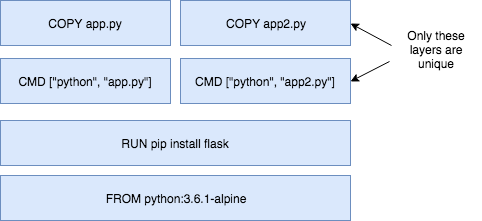

# Lab2 - カスタム Docker イメージを使用して付加価値を与える

このラボでは、Lab 1 で Docker コマンドを使用してコンテナを実行して学んだ知識を基に、Dockerfile からカスタム Docker イメージを作成し、それを中央レジストリーにプッシュします。こうすれば、そこからイメージをプルして他の環境にもデプロイできます。

このラボではまた、イメージを構成する層と、Docker が「コピー・オン・ライト」とユニオン・ファイル・システムを統合してイメージの保管とコンテナの実行を効率化する仕組みについても簡単に説明します。

このラボで使用する Docker コマンドは全体の一部にすぎません。使用できるコマンドについて詳しくは、[公式のドキュメント](http://docs.docker.jp/)を参照してください。

## 前提条件

Docker がインストール済みになっているか、[Play with Docker](http://play-with-docker.com) を使用できる状態になっていること。

## ステップ 1: Python アプリを作成する (Docker は使用しません)

1. 以下のコマンドを実行して、単純な Python プログラムが含まれた `app.py` という名前のファイルを作成します (コード・ブロック全体をコピーして貼り付けてください)。

```bash
echo 'from flask import Flask

app = Flask(__name__)

@app.route("/")
def hello():
    return "hello world!"

if __name__ == "__main__":
    app.run(host="0.0.0.0")' > app.py
```

この単純な Python アプリは、Flask を使用して HTTP Web サーバーをポート 5000 上で公開します (Flask のデフォルト・ポートは 5000 です)。Python や Flask について熟知していなくても不安に思わないでください。これらの概念は、どの言語で作成されたアプリケーションにも適用できます。

**オプション:** Python と pip がインストールされていれば、このアプリをローカルで実行できます。インストールされていない場合は、次のステップに進んでください。

```sh
$ python3 --version
Python 3.6.1
$ pip3 --version
pip 9.0.1 from /usr/local/lib/python3.6/site-packages (python 3.6)
$ pip3 install flask
Requirement already satisfied: flask in /usr/local/lib/python3.6/site-packages
Requirement already satisfied: Werkzeug>=0.7 in /usr/local/lib/python3.6/site-packages (from flask)
Requirement already satisfied: itsdangerous>=0.21 in /usr/local/lib/python3.6/site-packages (from flask)
Requirement already satisfied: Jinja2>=2.4 in /usr/local/lib/python3.6/site-packages (from flask)
Requirement already satisfied: click>=2.0 in /usr/local/lib/python3.6/site-packages (from flask)
Requirement already satisfied: MarkupSafe>=0.23 in /usr/local/lib/python3.6/site-packages (from Jinja2>=2.4->flask)
johns-mbp:test johnzaccone$ pip3 install flask
Requirement already satisfied: flask in /usr/local/lib/python3.6/site-packages
Requirement already satisfied: itsdangerous>=0.21 in /usr/local/lib/python3.6/site-packages (from flask)
Requirement already satisfied: Jinja2>=2.4 in /usr/local/lib/python3.6/site-packages (from flask)
Requirement already satisfied: click>=2.0 in /usr/local/lib/python3.6/site-packages (from flask)
Requirement already satisfied: Werkzeug>=0.7 in /usr/local/lib/python3.6/site-packages (from flask)
Requirement already satisfied: MarkupSafe>=0.23 in /usr/local/lib/python3.6/site-packages (from Jinja2>=2.4->flask)
$ python3 app.py
 * Running on http://0.0.0.0:5000/ (Press CTRL+C to quit)
```

## ステップ 2: Docker イメージを作成してビルドする

Python がローカルにインストールされていなくても心配しないでください！Python がインストールされていなくても、Python アプリを実行することはできます。Docker コンテナを使用する利点の 1 つは、Python をコンテナに組み込めることです。したがって、Python がホスト上にインストールされている必要はありません。

1. 以下のコマンドを実行して、`Dockerfile` ファイルを作成します。 (コード・ブロック全体をコピーして貼り付けてください)。

```sh
echo 'FROM python:3.6.1-alpine
RUN pip install flask
CMD ["python","app.py"]
COPY app.py /app.py' > Dockerfile
```

Dockerfile には、Docker イメージをビルドするために必要な命令をリストアップします。上記のファイルの内容を 1 行ずつ見ていきましょう。

**FROM python:3.6.1-alpine**
これが Dockerfile の出発点です。すべての Dockerfile は `FROM` 行で始まっていなければなりません。ここに指定されているイメージをベースに、イメージの層が構築されるためです。この例では基本層として `python:3.6.1-alpine` を選択しています。このイメージには、アプリケーションを実行するために必要なバージョンの Python と pip がすでに組み込まれています。

> `alpine` バージョンは、Linux の他のフレーバーよりも遥かにサイズが下回る Alpine ディストリビューションを使用していることを意味します。サイズの小さいイメージを使用すると、ダウンロード (デプロイ) の時間が大幅に縮小されます。さらに、攻撃対象領域が小さいことから、セキュリティー上のメリットもあります。

ここではイメージに「3.6.1-alpine」タグを指定しています。公式の Python イメージに利用できるタグについては、このリンク先の [Docker Hub](https://hub.docker.com/_/python/) をご覧ください。親イメージを継承する場合のベスト・プラクティスは、特定のタグを使用することです。こうすれば、親の依存関係に対する変更を管理できます。タグを指定しなければ、「latest」タグが適用されます。このタグは、イメージの最新バージョンを指す動的ポインターとして機能します。

セキュリティー上の理由から、Docker イメージをベースに層を構築する場合は、それらの層の構造を理解することが非常に重要です。このことから、[Docker Hub](https://hub.docker.com/) 内にある「Official Images」 または「Verified Publisher」のみを使用することを強く推奨します。これらのイメージは、特定のセキュリティー要件を満たしていることが[十分に検証](http://docs.docker.jp/docker-hub/official_repos.html)されているだけでなく、非常にわかりやすい優れたドキュメントも用意されています。この Python ベースのイメージの詳細については、[こちら](https://hub.docker.com/_/python)をご覧ください。また、使用できるすべてのイメージは、このリンク先の [Docker Hub](https://hub.docker.com/search/?type=image) で検索できます。

複雑なアプリケーションでは、プロセス・チェーンの上位にある `FROM` イメージを使用しなければならない場合もあります。例えば、この Python アプリの親 [Dockerfile](https://github.com/docker-library/python/blob/88ba87d31a3033d4dbefecf44ce25aa1b69ab3e5/3.6/alpine/Dockerfile) は `FROM alpine` で始まり、その後にイメージに対する `CMD` コマンドと `RUN` コマンドを指定しています。けれども、これよりもきめ細かく制御しなければならない場合は、`FROM alpine` (または別のディストリビューション) で開始して、これらのコマンドのステップを自分で実行することもできます。ただし手始めとしては、ニーズに最も適した公式イメージを使用することをお勧めします。

**RUN pip install flask**
この `RUN` コマンドは、アプリケーションに応じてイメージをセットアップするために必要なコマンド (パッケージのインストール、ファイルの編集、ファイル権限の変更など) を実行します。この例の場合、必要なセットアップとして Flask をインストールします。`RUN` コマンドはビルド時に実行されるため、イメージの層に追加されます。

**CMD ["python","app.py"]**
`CMD` は、コンテナの起動時に実行されるコマンドです。ここでは `CMD` を使用して Python アプリを実行します。

Dockerfile ごとに指定できる `CMD` は 1 つに限られます。複数の `CMD` を指定したとしても、最後の `CMD` しか適用されません。親イメージ python:3.6.1-alpine でも `CMD` (`CMD python2`) を指定しています。公式 python:alpine イメージの Dockerfile は、[こちら](https://github.com/docker-library/python/blob/88ba87d31a3033d4dbefecf44ce25aa1b69ab3e5/3.6/alpine/Dockerfile) で確認できます。

Python がホスト上にインストールされてなくても、公式の Python イメージを使用して直接 Python スクリプトを実行できます。けれども今回の作業では、ソースを組み込むためのカスタム・イメージを作成します。こうすれば、アプリケーションを含むイメージをビルドして、そのイメージを他の環境に配布できるようになります。

**COPY app.py /app.py**
このコマンドで、(`docker image build` を実行する) ローカル ディレクトリー内の app.py をイメージの新しい層にコピーします。この命令が Dockerfile 内の最後の行です。Docker の層キャッシュをフル活用できるよう、ソース・コードをイメージにコピーするなどして頻繁に変更される層はファイルの下のほうに配置してください。こうすることで、従来キャッシュされるはずの層を再構築しなくても済むようになります。例えば、`FROM` 命令に変更があった場合、このイメージでその下位にあるすべての層のキャッシュが無効になります。その例については、このラボのもう少し後で説明します。

このコマンドを `CMD ["python","app.py"]` 行の後に配置するのは直感に反しているように思えますが、`CMD` 行が実行されるのは、コンテナが起動する時点のみです。したがって、`file not found` のエラーが発生することはありません。

非常に単純な Dockerfile の説明は以上です。Dockerfile 内で使用できるコマンドの完全なリストについては、[こちら](https://docs.docker.com/engine/reference/builder/)をご覧ください。これで、Dockerfile の定義が完了しました。次は、この Dockerfile を使用してカスタム Docker イメージをビルドしましょう。

2. Docker イメージをビルドします。

`-t` を渡してイメージに `python-hello-world` という名前を指定します。

```sh
$ docker image build -t python-hello-world .
Sending build context to Docker daemon  3.072kB
Step 1/4 : FROM python:3.6.1-alpine
3.6.1-alpine: Pulling from library/python
acb474fa8956: Pull complete
967ab02d1ea4: Pull complete
640064d26350: Pull complete
db0225fcac8f: Pull complete
5432cc692c60: Pull complete
Digest: sha256:768360b3fad01adffcf5ad9eccb4aa3ccc83bb0ed341bbdc45951e89335082ce
Status: Downloaded newer image for python:3.6.1-alpine
 ---> c86415c03c37
Step 2/4 : RUN pip install flask
 ---> Running in cac3222673a3
Collecting flask
  Downloading Flask-0.12.2-py2.py3-none-any.whl (83kB)
Collecting itsdangerous>=0.21 (from flask)
  Downloading itsdangerous-0.24.tar.gz (46kB)
Collecting click>=2.0 (from flask)
  Downloading click-6.7-py2.py3-none-any.whl (71kB)
Collecting Werkzeug>=0.7 (from flask)
  Downloading Werkzeug-0.12.2-py2.py3-none-any.whl (312kB)
Collecting Jinja2>=2.4 (from flask)
  Downloading Jinja2-2.9.6-py2.py3-none-any.whl (340kB)
Collecting MarkupSafe>=0.23 (from Jinja2>=2.4->flask)
  Downloading MarkupSafe-1.0.tar.gz
Building wheels for collected packages: itsdangerous, MarkupSafe
  Running setup.py bdist_wheel for itsdangerous: started
  Running setup.py bdist_wheel for itsdangerous: finished with status 'done'
  Stored in directory:/root/.cache/pip/wheels/fc/a8/66/24d655233c757e178d45dea2de22a04c6d92766abfb741129a
  Running setup.py bdist_wheel for MarkupSafe: started
  Running setup.py bdist_wheel for MarkupSafe: finished with status 'done'
  Stored in directory:/root/.cache/pip/wheels/88/a7/30/e39a54a87bcbe25308fa3ca64e8ddc75d9b3e5afa21ee32d57
Successfully built itsdangerous MarkupSafe
Installing collected packages: itsdangerous, click, Werkzeug, MarkupSafe, Jinja2, flask
Successfully installed Jinja2-2.9.6 MarkupSafe-1.0 Werkzeug-0.12.2 click-6.7 flask-0.12.2 itsdangerous-0.24
 ---> ce41f2517c16
Removing intermediate container cac3222673a3
Step 3/4 : CMD python app.py
 ---> Running in 2197e5263eff
 ---> 0ab91286958b
Removing intermediate container 2197e5263eff
Step 4/4 : COPY app.py /app.py
 ---> f1b2781b3111
Removing intermediate container b92b506ee093
Successfully built f1b2781b3111
Successfully tagged python-hello-world:latest
```

`docker image ls` を使用して、カスタム・イメージがイメージ・リストに示されることを確認します。

```sh
$ docker image ls
REPOSITORY           TAG                 IMAGE ID            CREATED             SIZE
python-hello-world   latest              f1b2781b3111        26 seconds ago      99.3MB
python               3.6.1-alpine        c86415c03c37        8 days ago          88.7MB
```

ベース・イメージ python:3.6.1-alpine もイメージ・リストに示されることに注目してください。

## ステップ 3: Docker イメージを実行する

イメージのビルドが完了したら、そのイメージを実行して機能するかどうかを確認できます。

1. Docker イメージを実行します。
```sh
$ docker run -p 5001:5000 -d python-hello-world
0b2ba61df37fb4038d9ae5d145740c63c2c211ae2729fc27dc01b82b5aaafa26
```

`-p` フラグでは、コンテナ内で実行されているポートをホストにマッピングします。この例の場合、コンテナ内のポート 5000 上で実行されている Python アプリをホスト上のポート 5001 にマッピングしています。ホスト上の別のアプリケーションによってポート 5001 がすでに使用されている場合は、5001 を別の値 (5002 など) で置き換える必要があります。

コンテナが立ち上がらなかった場合は、以下のコマンドで立ち上がらなかった理由をログを確認して調べてみましょう。

```sh
# 停止中も含めたコンテナ一覧を表示
$ docker ps -a

# <CONTAINER ID>を指定してログを確認
$ docker logs <CONTAINER ID>
```

2. ブラウザー内で http://localhost:5001 にアクセスして、結果を確認します。

Play with Docker では、セッションの上部に表示されているリンク `5001` をクリックします。それでもポートが表示されない場合は、`curl localhost:5001` を実行してください。

ブラウザー上に「hello world!」と表示されるはずです。

3. コンテナのログ出力を確認します。

アプリケーションからログを確認する場合は、`docker container logs` コマンドを使用できます。デフォルトでは、`docker container logs` はアプリケーションが送信した内容を標準出力に出力します。実行中のコンテナの ID は、`docker container ls` を使用して確認できます。

```sh
$ docker container logs [container id]
 * Running on http://0.0.0.0:5000/ (Press CTRL+C to quit)
172.17.0.1 - - [28/Jun/2017 19:35:33] "GET / HTTP/1.1" 200 -
```

Dockerfile は、アプリケーションの再現可能なビルドを作成する手段です。一般的なワークフローであれば、CI/CD 自動化でビルド・プロセスの一環として `docker image build` を実行させます。ビルドされたイメージは中央レジストリーに送信されます。アプリケーションのインスタンスを実行する必要のあるすべての環境 (テスト環境など) は、この中央レジストリーでイメージにアクセスできます。次のステップで、公開 Docker レジストリーとしての Docker Hub にカスタム・イメージをプッシュし、他の開発者やオペレーターがカスタム・イメージを利用できるようにします。


## ステップ 4: 中央レジストリーにプッシュする

1. https://hub.docker.com にアクセスして、アカウントを作成します (まだ作成していない場合)。

このラボでは、中央レジストリーとして Docker Hub を使用します。Docker Hub は、一般公開されたイメージを保管する無料のサービスです。料金を支払えば、プライベート・イメージを保管することもできます。[DockerHub](https://hub.docker.com) Web サイトにアクセスして、無料アカウントを作成してください。

Docker を多用する組織では、独自のレジストリーを内部でセットアップするのが常となっています。ここでは単純にするために Docker Hub を使用しますが、以降で説明する概念はあらゆるレジストリーに適用されます。

2. ログインします。

Docker レジストリーのアカウントにログインするには、ターミナル上で `docker login` と入力します。

```
$ docker login
Login with your Docker ID to push and pull images from Docker Hub.If you don't have a Docker ID, head over to https://hub.docker.com to create one.
Username:
```

3. イメージにユーザー名でタグを付けます。

Docker Hub の命名規則では、イメージに [Docker Hub ユーザー名]/[イメージ名] 形式のタグを付けることになっています。この形式に従い、前に作成したイメージ `python-hello-world` にタグを付けます。

```sh
$ docker tag python-hello-world [dockerhub username]/python-hello-world
```

4. イメージをレジストリーにプッシュします。

イメージに適切にタグを付けたら、`docker push` コマンドを使用して Docker Hub レジストリーにイメージをプッシュします。

```sh
$ docker push [dockerhub username]/python-hello-world
The push refers to a repository [docker.io/jzaccone/python-hello-world]
2bce026769ac: Pushed
64d445ecbe93: Pushed
18b27eac38a1: Mounted from library/python
3f6f25cd8b1e: Mounted from library/python
b7af9d602a0f: Mounted from library/python
ed06208397d5: Mounted from library/python
5accac14015f: Mounted from library/python
latest: digest: sha256:508238f264616bf7bf962019d1a3826f8487ed6a48b80bf41fd3996c7175fd0f size: 1786
```

5. ブラウザー内で Docker Hub にプッシュされたイメージを確認します。

https://hub.docker.com にアクセスし、プロファイルを表示して新しくアップロードしたイメージを確認します。

これでイメージが Docker Hub 上にアップロードされました。他の開発者やオペレーターが `docker pull` コマンドを使用すれば、このイメージを他の環境にデプロイできます。  

**注:** Docker イメージには、そのイメージ内のアプリケーションを実行するために必要なすべての依存関係が含まれています。したがって、デプロイ先の環境にインストールされている依存関係を頼りにする場合でも、環境の違い (バージョンの違い) に対処しなくて済みます。また、環境をプロビジョニングするために追加の手順を行う必要もありません。Docker をインストールするだけで、アプリケーションが実行可能な状態になります。

## ステップ 5: 変更をデプロイする
「hello world!」アプリケーションは見慣れてしまっているので、ちょっと変更して「Hello Beautiful World!」と表示されるようにアプリを更新しましょう。

1. `app.py` を更新します。

`app.py` 内の文字列「Hello World」を「Hello Beautiful World!」で置き換えます。ファイルを更新するには、以下のコマンドを使用します (コード・ブロック全体をコピーして貼り付けてください)。

```bash
echo 'from flask import Flask

app = Flask(__name__)

@app.route("/")
def hello():
    return "hello beautiful world!"

if __name__ == "__main__":
    app.run(host="0.0.0.0")' > app.py
```

2. イメージを再ビルドしてからプッシュします。

アプリの更新が完了したら、上記の手順を繰り返してアプリを再ビルドし、Docker Hub レジストリーにプッシュする必要があります。

まずイメージを再ビルドしますが、今回は build コマンドで Docker Hub ユーザー名を使用します。

```sh
$  docker image build -t [dockerhub username]/python-hello-world .
Sending build context to Docker daemon  3.072kB
Step 1/4 : FROM python:3.6.1-alpine
 ---> c86415c03c37
Step 2/4 : RUN pip install flask
 ---> Using cache
 ---> ce41f2517c16
Step 3/4 : CMD python app.py
 ---> Using cache
 ---> 0ab91286958b
Step 4/4 : COPY app.py /app.py
 ---> 3e08b2eeace1
Removing intermediate container 23a955e881fc
Successfully built 3e08b2eeace1
Successfully tagged jzaccone/python-hello-world:latest
```

ステップ 1 ～ 3 に「Using cache (キャッシュを使用)」とあることに注目してください。これらのステップで参照している Docker イメージの層はすでに構築されているため、`docker image build` では層を再構築するのではなく、キャッシュされている層を使用します。

```sh
$ docker push [dockerhub username]/python-hello-world
The push refers to a repository [docker.io/jzaccone/python-hello-world]
94525867566e: Pushed
64d445ecbe93: Layer already exists
18b27eac38a1: Layer already exists
3f6f25cd8b1e: Layer already exists
b7af9d602a0f: Layer already exists
ed06208397d5: Layer already exists
5accac14015f: Layer already exists
latest: digest: sha256:91874e88c14f217b4cab1dd5510da307bf7d9364bd39860c9cc8688573ab1a3a size: 1786
```

層のプッシュでもキャッシング・メカニズムが使用されます。前回プッシュされた層のうち、Docker Hub に足りない層は 1 つだけです。したがって、変更されたその層だけがプッシュされます。

層を変更すると、その層をベースに構築されたすべての層を再構築しなければならなくなります。Dockerfile 内の各行は、その前の行で作成された層をベースに新しい層を構築するため、Dockerfile 内での行の順序は重要です。ここで使用している Dockerfile についてはすでに最適化を実施してあり、変更される可能性が最も高い層 (`COPY app.py /app.py`) が Dockerfile 内の最後の行となっています。なぜなら、アプリケーションでは通常、コードが最も頻繁に変更されるためです。このような最適化は、自動化を可能な限り高速で行う必要のある CI/CD プロセスではとりわけ重要となります。

## ステップ 6: イメージの層について理解する

Docker の主要な設計特性のうちの 1 つは、ユニオン・ファイル・システムを使用することです。

前に作成した Dockerfile で、イメージの層を見ていきましょう。
```sh
FROM python:3.6.1-alpine
RUN pip install flask
CMD ["python","app.py"]
COPY app.py /app.py
```

以上の行のそれぞれが 1 つの層です。各層には差分、すなわちその前の層からの変更だけが含まれます。こうした層を 1 つのコンテナにまとめて実行するために、Docker ではユニオン・ファイル・システムを利用して、複数の層をトランスペアレントに重ねて単一のビューにします。

イメージの各層は読み取り専用ですが、コンテナ用に作成された最上位の層はその例外です。この読み取り/書き込みコンテナ層は「コピー・オン・ライト」を実装します。つまり、下位のイメージ層に保管されたファイルが編集される場合にのみ、その下位層から読み取り/書き込みコンテナ層にファイルがプルされます。ファイルに加えられた変更はコンテナ層に保管されます。「コピー・オン・ライト」関数は非常に高速で、ほぼすべての場合において、パフォーマンスに目立った影響を与えません。`docker diff` コマンドを使用すると、どのファイルがコンテナ・レベルにプルされたのかを確認できます。`docker diff` の使用方法について詳しくは、[こちら](http://docs.docker.jp/engine/reference/commandline/diff.html)をご覧ください。



イメージ層は読み取り専用であることから、複数のイメージでも実行中の複数のコンテナでもイメージ層を共有できます。例えば、独自の Dockerfile で同様の基本層からなる新しい Python アプリを作成すると、そのアプリでは、最初の Python アプリと共通するすべての層が共有されることになります。

```sh
FROM python:3.6.1-alpine
RUN pip install flask
CMD ["python","app2.py"]
COPY app2.py /app2.py
```



同じイメージから作成された複数のコンテナを起動する場合も、層が共有されることになります。これらコンテナは同じ読み取り専用のイメージ層を使用することを考えると、コンテナが極めて高速に起動され、ホスト上のフットプリントもごくわずかであることを想像できるはずです。

お気付きかもしれませんが、上記の Dockerfile と、このラボで前に作成した Dockerfile には、重複する行がいくつかあります。これは非常に単純な例ですが、両方の Dockerfile から共通する行を抽出して「ベース」Dockerfile にまとめれば、FROM` コマンドを使用する子 Dockerfile のそれぞれで、そのベース Dockerfile を指すことができます。

イメージを層化することにより、ビルドとプッシュの Docker キャッシング・メカニズムが有効になります。例えば、最後の `docker push` の出力には、イメージのいくつかの層が Docker Hub 上にすでに存在することが示されています。

```sh
$ docker push [dockerhub username]/python-hello-world
The push refers to a repository [docker.io/jzaccone/python-hello-world]
94525867566e: Pushed
64d445ecbe93: Layer already exists
18b27eac38a1: Layer already exists
3f6f25cd8b1e: Layer already exists
b7af9d602a0f: Layer already exists
ed06208397d5: Layer already exists
5accac14015f: Layer already exists
latest: digest: sha256:91874e88c14f217b4cab1dd5510da307bf7d9364bd39860c9cc8688573ab1a3a size: 1786
```

層をさらに詳しく調べるには、前に Python イメージを作成した際の `docker image history` コマンドを使用できます。

```sh
$ docker image history python-hello-world
IMAGE               CREATED             CREATED BY                                      SIZE                COMMENT
f1b2781b3111        5 minutes ago       /bin/sh -c #(nop) COPY file:0114358808a1bb...   159B                
0ab91286958b        5 minutes ago       /bin/sh -c #(nop)  CMD ["python" "app.py"]      0B                  
ce41f2517c16        5 minutes ago       /bin/sh -c pip install flask                    10.6MB              
c86415c03c37        8 days ago          /bin/sh -c #(nop)  CMD ["python3"]              0B                  
<missing>           8 days ago          /bin/sh -c set -ex;   apk add --no-cache -...   5.73MB              
<missing>           8 days ago          /bin/sh -c #(nop)  ENV PYTHON_PIP_VERSION=...   0B                  
<missing>           8 days ago          /bin/sh -c cd /usr/local/bin  && ln -s idl...   32B                 
<missing>           8 days ago          /bin/sh -c set -ex  && apk add --no-cache ...   77.5MB              
<missing>           8 days ago          /bin/sh -c #(nop)  ENV PYTHON_VERSION=3.6.1     0B                  
<missing>           8 days ago          /bin/sh -c #(nop)  ENV GPG_KEY=0D96DF4D411...   0B                  
<missing>           8 days ago          /bin/sh -c apk add --no-cache ca-certificates   618kB               
<missing>           8 days ago          /bin/sh -c #(nop)  ENV LANG=C.UTF-8             0B                  
<missing>           8 days ago          /bin/sh -c #(nop)  ENV PATH=/usr/local/bin...   0B                  
<missing>           9 days ago          /bin/sh -c #(nop)  CMD ["/bin/sh"]              0B                  
<missing>           9 days ago          /bin/sh -c #(nop) ADD file:cf1b74f7af8abcf...   4.81MB  
```

各行が、イメージの 1 つの層を表します。上のほうにある行は、前に作成した Dockerfile に対応します。下のほうにある行は、親 Python イメージからプルされたものです。「\<missing\>」タグは無視して構いません。層にこのタグが設定されていても、それは通常の層であり、Docker システムによって ID が割り当てられていないだけに過ぎません。

## ステップ 7: クリーンアップ

このラボの手順に従うと、最終的にはホスト上で一連のコンテナが実行されることになります。これらのコンテナをクリーンアップしましょう。

1. 実行中のコンテナのそれぞれに対して、`docker container stop [コンテナ ID]` を実行します。

まず、`docker container ls` を使用して、実行中のコンテナのリストを取得します。
```sh
$ docker container ls
CONTAINER ID        IMAGE                COMMAND             CREATED             STATUS              PORTS                    NAMES
0b2ba61df37f        python-hello-world   "python app.py"     7 minutes ago       Up 7 minutes        0.0.0.0:5001->5000/tcp   practical_kirch
```
次に、リストに含まれるコンテナごとに `docker container stop [コンテナ ID]` を実行します。
```sh
$ docker container stop 0b2
0b2
```

2. 停止したコンテナを削除します。

システムをクリーンアップするには、`docker system prune` コマンドが大いに重宝します。このコマンドは、停止されているコンテナ、未使用のボリュームとネットワーク、孤立したイメージのすべてを削除します。

```sh
$ docker system prune
WARNING!This will remove:
        - all stopped containers
        - all volumes not used by at least one container
        - all networks not used by at least one container
        - all dangling images
Are you sure you want to continue?[y/N] y
Deleted Containers:
0b2ba61df37fb4038d9ae5d145740c63c2c211ae2729fc27dc01b82b5aaafa26

Total reclaimed space: 300.3kB
```

## まとめ

このラボでは、独自のカスタム Docker コンテナを作成して付加価値を与える作業を開始しました。

このラボで学んだ重要な点
- Dockerfile は、アプリケーションの再現可能なビルドを作成して、Docker を使用したアプリケーションを CI/CD パイプラインに統合する手段です。
- Docker イメージをあらゆる環境で利用できるようにするには、中央レジストリーにイメージをプッシュします。こうした中央レジストリーの一例としては Docker Hub を使用できますが、管理対象のサーバー上に独自のレジストリーをデプロイすることもできます。
- Docker イメージには、そのイメージ内のアプリケーションを実行するために必要なすべての依存関係が含まれています。したがって、デプロイ先の環境にインストールされている依存関係を頼りにする場合でも、環境の違い (バージョンの違い) に対処しなくて済みます。
- Docker ではユニオン・ファイル・システムと「コピー・オン・ライト」を利用してイメージの層を再利用します。これにより、イメージを保管するフットプリントが縮小され、コンテナ起動時のパフォーマンスが大幅に向上します。
- イメージ層は Docker ビルドおよびプッシュ・システムによってキャッシュされます。したがって、対象とするシステム上にすでに存在するイメージ層を再構築したり再プッシュしたりする必要はありません。
- Dockerfile 内の各行が 1 つの新しい層を作成します。層はキャッシュされるため、頻繁に変更される行 (ソース・コードをイメージに追加する行など) はファイルの下のほうに配置する必要があります。

次のハンズオンはこちら [Lab3](../lab-3/README.md) です。
