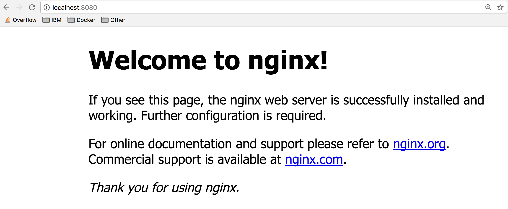

# Lab 1 - Running Your First Container

## Overview

In this lab, you will run your first Docker container.

Containers are just a process (or a group of processes) running in isolation. Isolation is achieved via linux namespaces and control groups. One thing to note, is that linux namespaces and control groups are features that are built into the linux kernel! Other than the linux kernel itself, there is nothing special about containers.

What makes containers useful is the tooling that surrounds it. For these labs, we will be using Docker, which has been the de facto standard tool for using containers to build applications. Docker provides developers and operators with a friendly interface to build, ship and run containers on any environment.

The first part of this lab, we will run our first container, and learn how to inspect it. We will be able to witness the namespace isolation that we acquire from the linux kernel.

After we run our first container, we will dive into other uses of docker containers. We will find many examples of these on the Docker Store, and we will run several different types of containers on the same host. This will allow us to see the benefit of isolation- where we can run multiple containers on the same host without conflicts.

We will be using a few Docker commands in this lab. For full documentation on available commands check out the [official documentation](https://docs.docker.com/).

### Prerequisites

Completed Lab 0: You must have docker installed, or be using [Play with Docker](http://play-with-docker.com).

## Step 1: Run your first container

We are going to use the Docker CLI to run our first container.

1. Open a terminal on your local computer

1. Run `docker container run -t ubuntu top`

    Use the `docker container run` command to run a container with the ubuntu image using the `top` command. The `-t` flags allocate a pseudo-TTY which we need for the `top` to work correctly.

    ```sh
    $ docker container run -it ubuntu top
    Unable to find image 'ubuntu:latest' locally
    latest: Pulling from library/ubuntu
    aafe6b5e13de: Pull complete
    0a2b43a72660: Pull complete
    18bdd1e546d2: Pull complete
    8198342c3e05: Pull complete
    f56970a44fd4: Pull complete
    Digest: sha256:f3a61450ae43896c4332bda5e78b453f4a93179045f20c8181043b26b5e79028
    Status: Downloaded newer image for ubuntu:latest
    ```

    The `docker run` command will result first in a `docker pull` to download the ubuntu image onto your host. Once it is downloaded, it will start the container. The output for the running container should look like this:

    ```sh
    top - 20:32:46 up 3 days, 17:40,  0 users,  load average: 0.00, 0.01, 0.00
    Tasks:   1 total,   1 running,   0 sleeping,   0 stopped,   0 zombie
    %Cpu(s):  0.0 us,  0.1 sy,  0.0 ni, 99.9 id,  0.0 wa,  0.0 hi,  0.0 si,  0.0 st
    KiB Mem :  2046768 total,   173308 free,   117248 used,  1756212 buff/cache
    KiB Swap:  1048572 total,  1048572 free,        0 used.  1548356 avail Mem

    PID USER      PR  NI    VIRT    RES    SHR S  %CPU %MEM     TIME+ COMMAND
        1 root      20   0   36636   3072   2640 R   0.3  0.2   0:00.04 top
    ```

    `top` is a linux utility that prints the processes on a system and orders them by resource consumption. Notice that there is only a single process in this output: it is the `top` process itself. We don't see other processes from our host in this list because of the PID namespace isolation.

    Containers use linux namespaces to provide isolation of system resources from other containers or the host. The PID namespace provides isolation for process IDs. If you run `top` while inside the container, you will notice that it shows the processes within the PID namespace of the container, which is much different than what you can see if you ran `top` on the host.

    Even though we are using the `ubuntu` image, it is important to note that our container does not have its own kernel. Its uses the kernel of the host and the `ubuntu` image is used only to provide the file system and tools available on an ubuntu system.

1. Inspect the container with `docker container exec`

    The `docker container exec` command is a way to "enter" a running container's namespaces with a new process.

    Open a new terminal. To open a new terminal connected to node1 using play-with-docker.com, click "Add New Instance" on the lefthand side, then ssh from node2 into node1 using the IP that is listed by 'node1  '. For example:

    ```sh
    [node2] (local) root@192.168.0.17 ~
    $ ssh 192.168.0.18
    [node1] (local) root@192.168.0.18 ~
    $
    ```

    In the new terminal, use the `docker container ls` command to get the ID of the running container you just created.

    ```sh
    $ docker container ls
    CONTAINER ID        IMAGE                      COMMAND                  CREATED             STATUS                         PORTS                       NAMES
    b3ad2a23fab3        ubuntu                     "top"                    29 minutes ago      Up 29 minutes                                              goofy_nobel
    ```

    Then use that id to run `bash` inside that container using the `docker container exec` command. Since we are using bash and want to interact with this container from our terminal, use `-it` flags to run using interactive mode while allocating a psuedo-terminal.

    ```sh
    $ docker container exec -it b3ad2a23fab3 bash
    root@b3ad2a23fab3:/#
    ```

    And Voila! We just used the `docker container exec` command to "enter" our container's namespaces with our bash process. Using `docker container exec` with `bash` is a common pattern to inspect a docker container.

    Notice the change in the prefix of your terminal. e.g. `root@b3ad2a23fab3:/`. This is an indication that we are running bash "inside" of our container.

    **Note**: This is not the same as ssh'ing into a separate host or a VM. We don't need an ssh server to connect with a bash process. Remember that containers use kernel-level features to achieve isolation and that containers run on top of the kernel. Our container is just a group of processes running in isolation on the same host, and we can use `docker container exec` to enter that isolation with the `bash` process. After running `docker container exec`, the group of processes running in isolation (i.e. our container) include `top` and `bash`.

    From the same termina, run `ps -ef` to inspect the running processes.

    ```sh
    root@b3ad2a23fab3:/# ps -ef
    UID        PID  PPID  C STIME TTY          TIME CMD
    root         1     0  0 20:34 ?        00:00:00 top
    root        17     0  0 21:06 ?        00:00:00 bash
    root        27    17  0 21:14 ?        00:00:00 ps -ef
    ```

    You should see only the `top` process, `bash` process and our `ps` process.

    For comparison, exit the container, and run `ps -ef` or `top` on the host. These commands will work on linux or mac. For windows, you can inspect the running processes using `tasklist`.

    ```sh
    root@b3ad2a23fab3:/# exit
    exit
    $ ps -ef
    # Lots of processes!
    ```

    *Technical Deep Dive*
    PID is just one of the linux namespaces that provides containers with isolation to system resources. Other linux namespaces include:
    - MNT - Mount and unmount directories without affecting other namespaces
    - NET - Containers have their own network stack
    - IPC - Isolated interprocess communication mechanisms such as message queues.
    - User - Isolated view of users on the system
    - UTC - Set hostname and domain name per container

    These namespaces together provide the isolation for containers that allow them to run together securely and without conflict with other containers running on the same system. Next we will demonstrate different uses of containers. and the benefit of isolation as we run multiple containers on the same host.

    **Note**: Namespaces are a feature of the **linux** kernel. But Docker allows you to run containers on Windows and Mac... how does that work? The secret is that embedded in the Docker product is a linux subsystem. Docker open-sourced this linux subsystem to a new project: [LinuxKit](https://github.com/linuxkit/linuxkit). Being able to run containers on many different platforms is one advantage of using the Docker tooling with containers.

    In additional to running linux containers on Windows using a linux subsystem, native Windows containers are now possible due the creation of container primitives on the Windows OS. Native Windows containers can be run on Windows 10 or Windows Server 2016 or newer.

1. Clean up the container running the `top` processes by typing: `<ctrl>-c.`

## Step 2: Run Multiple Containers

1. Explore the Docker Store

    The [Docker Store](https://store.docker.com) is the public central registry for Docker images. Anyone can share images here publicly. The Docker Store contains community and official images that can also be found directly on the [Docker Hub](https://hub.docker.com/explore/).

    When searching for images you will find filters for "Store" vs "Community" images. "Store" images include content that has been verified and scanned for security vulnerabilities by Docker. Go one step further and search for "Certified" images, that are deemed enterprise-ready and are tested with Docker Enterprise Edition product. It is important to avoid using unverified content from the Docker Store when developing your own images that are intended to be deployed into the production environment. These unverified images may contain security vulnerabilities or possibly even malicious software.

    In Step 2 of this lab, we will start a couple of containers using some verified images from the Docker Store: nginx web server, and mongo database.

1. Run an Nginx server

    Let's run a container using the [official Nginx image](https://store.docker.com/images/nginx) from the Docker Store.

    ```sh
    $ docker container run --detach --publish 8080:80 --name nginx nginx
    Unable to find image 'nginx:latest' locally
    latest: Pulling from library/nginx
    36a46ebd5019: Pull complete
    57168433389f: Pull complete
    332ec8285c50: Pull complete
    Digest: sha256:c15f1fb8fd55c60c72f940a76da76a5fccce2fefa0dd9b17967b9e40b0355316
    Status: Downloaded newer image for nginx:latest
    5e1bf0e6b926bd73a66f98b3cbe23d04189c16a43d55dd46b8486359f6fdf048
    ```

    We are using a couple of new flags here. The `--detach` flag will run this container in the background. The `publish` flag publishes port 80 in the container (the default port for nginx), via port 8080 on our host. Remember that the NET namespace gives processes of the container their own network stack. The `--publish` flag is a feature that allows us to expose networking through the container onto the host.

    How do you know port 80 is the default port for nginx? Because it is listed in the [documentation](https://store.docker.com/images/nginx) on the Docker Store. In general, the documentation for the verified images is very good, and you will want to refer to them when running containers using those images.

    We are also specifying the `--name` flag, which names the container. Every container has a name, if you don't specify one, Docker will randomly assign one for you. Specifying your own name makes it easier to run subsequent commands on your container since you can reference the name instead of the id of the container. For example: `docker container inspect nginx` instead of `docker container inspect 5e1`.

    Since this is the first time you are running the nginx container, it will pull down the nginx image from the Docker Store. Subsequent containers created from the Nginx image will use the existing image located on your host.

    Nginx is a lightweight web server. You can access it on port 8080 on your localhost.

1. Access the nginx server on [localhost:8080](http://localhost:8080). If you are using play-with-docker, look for the `8080` link near the top of the page.

    

1. Run a mongo DB server

    Now, run a mongoDB server. We will use the [official mongoDB image](https://store.docker.com/images/mongo) from the Docker Store. Instead of using the `latest` tag (which is the default if no tag is specified), we will use a specific version of the mongo image: 3.4.

    ```sh
    $ docker container run --detach --publish 8081:27017 --name mongo mongo:3.4
    Unable to find image 'mongo:3.4' locally
    3.4: Pulling from library/mongo
    d13d02fa248d: Already exists
    bc8e2652ce92: Pull complete
    3cc856886986: Pull complete
    c319e9ec4517: Pull complete
    b4cbf8808f94: Pull complete
    cb98a53e6676: Pull complete
    f0485050cd8a: Pull complete
    ac36cdc414b3: Pull complete
    61814e3c487b: Pull complete
    523a9f1da6b9: Pull complete
    3b4beaef77a2: Pull complete
    Digest: sha256:d13c897516e497e898c229e2467f4953314b63e48d4990d3215d876ef9d1fc7c
    Status: Downloaded newer image for mongo:3.4
    d8f614a4969fb1229f538e171850512f10f490cb1a96fca27e4aa89ac082eba5
    ```

    Again, since this is the first time we are running a mongo container, we will pull down the mongo image from the Docker Store. We are using the `--publish` flag to expose the 27017 mongo port on our host. We have to use a port other than 8080 for the host mapping, since that port is already exposed on our host. Again refer to the [official docs](https://store.docker.com/images/mongo) on the Docker Store to get more details about using the mongo image.

1. Access [localhost:8081](http://localhost:8081) to see some output from mongo. If you are using play-with-docker, look for the `8080` link near the top of the page.

    

1. Check your running containers with `docker container ls`

    ```sh
    $ docker container ls
    CONTAINER ID        IMAGE               COMMAND                  CREATED                  STATUS              PORTS                     NAMES
    d6777df89fea        nginx               "nginx -g 'daemon ..."   Less than a second ago   Up 2 seconds        0.0.0.0:8080->80/tcp      nginx
    ead80a0db505        mongo               "docker-entrypoint..."   17 seconds ago           Up 19 seconds       0.0.0.0:8081->27017/tcp   mongo
    af549dccd5cf        ubuntu              "top"                    5 minutes ago            Up 5 minutes                                  priceless_kepler
    ```

    You should see that you have an Nginx web server container, and a MongoDB container running on your host. Note that we have not configured these containers to talk to each other.

    You can see the "nginx" and "mongo" names that we gave to our containers, and the random name (in my case "priceless_kepler") that was generated for the ubuntu container. You can also see that the port mappings that we specified with the `--publish` flag. For more details information on these running containers you can use the `docker container inspect [container id` command.

    One thing you might notice is that the mongo container is running the `docker-entrypoint` command. This is the name of the executable that is run when the container is started. The mongo image requires some prior configuration before kicking off the DB process. You can see exactly what the script does by looking at it on [github](https://github.com/docker-library/mongo/blob/master/3.0/docker-entrypoint.sh). Typically, you can find the link to the github source from the image description page on the Docker Store website.

    Containers are self-contained and isolated, which means we can avoid potential conflicts between containers with different system or runtime dependencies. For example: deploying an app that uses Java 7 and another app that uses Java 8 on the same host. Or running multiple nginx containers that all have port 80 as their default listening ports (if exposing on the host using the `--publish` flag, the ports selected for the host will need to be unique). Isolation benefits are possible because of Linux Namespaces.

    **Note**: You didn't have to install anything on your host (other than Docker) to run these processes! Each container includes the dependencies that it needs within the container, so you don't need to install anything on your host directly.

    Running multiple containers on the same host gives us the ability to fully utilize the resources (cpu, memory, etc) available on single host. This can result in huge cost savings for an enterprise.

    While running images directly from the Docker Store can be useful at times, it is more useful to create custom images, and refer to official images as the starting point for these images. We will dive into building our own custom images in Lab 2.

## Step 3: Clean Up

Completing this lab results in a bunch of running containers on your host. Let's clean these up.

1. First get a list of the containers running using `docker container ls`.

    ```sh
    $ docker container ls
    CONTAINER ID        IMAGE               COMMAND                  CREATED             STATUS              PORTS                     NAMES
    d6777df89fea        nginx               "nginx -g 'daemon ..."   3 minutes ago       Up 3 minutes        0.0.0.0:8080->80/tcp      nginx
    ead80a0db505        mongo               "docker-entrypoint..."   3 minutes ago       Up 3 minutes        0.0.0.0:8081->27017/tcp   mongo
    af549dccd5cf        ubuntu              "top"                    8 minutes ago       Up 8 minutes                                  priceless_kepler
    ```

1. Next,  run `docker container stop [container id]` for each container in the list. You can also use the names of the containers that you specified before.

    ```sh
    $ docker container stop d67 ead af5
    d67
    ead
    af5
    ```

    **Note**: You only have to reference enough digits of the ID to be unique. Three digits is almost always enough.

1. Remove the stopped containers

    `docker system prune` is a really handy command to clean up your system. It will remove any stopped containers, unused volumes and networks, and dangling images.

    ```sh
    $ docker system prune
    WARNING! This will remove:
            - all stopped containers
            - all volumes not used by at least one container
            - all networks not used by at least one container
            - all dangling images
    Are you sure you want to continue? [y/N] y
    Deleted Containers:
    7872fd96ea4695795c41150a06067d605f69702dbcb9ce49492c9029f0e1b44b
    60abd5ee65b1e2732ddc02b971a86e22de1c1c446dab165462a08b037ef7835c
    31617fdd8e5f584c51ce182757e24a1c9620257027665c20be75aa3ab6591740

    Total reclaimed space: 12B
    ```

## Summary

In this lab, you created your first Ubuntu, Nginx and MongoDB containers.

Key Takeaways

- Containers are composed of linux namespaces and control groups that provide isolation from other containers and the host.
- Because of the isolation properties of containers, you can schedule many containers on a single host without worrying about conflicting dependencies. This makes it easier to run multiple containers on a single host: fully utilizing resources allocated to that host, and ultimately saving some money on server costs.
- Avoid using unverified content from the Docker Store when developing your own images because these images may contain security vulnerabilities or possibly even malicious software.
- Containers include everything they need to run the processes within them, so there is no need to install additional dependencies directly on your host.
