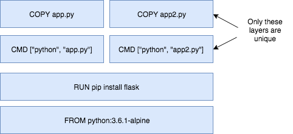

# Lab 2- Adding Value with Custom Docker Images

## Overview

In this lab, we build on our knowledge from lab 1 where we used Docker commands to run containers. We will create a custom Docker Image built from a Dockerfile. Once we build the image, we will push it to a central registry where it can be pulled to be deployed on other environments. Also, we will briefly describe image layers, and how Docker incorporates "copy-on-write" and the union file system to efficiently store images and run containers.

We will be using a few Docker commands in this lab. For full documentation on available commands check out the [official documentation](https://docs.docker.com/).

### Prerequisites

You must have docker installed, or be using [Katacoda Playground](https://www.katacoda.com/courses/docker/playground).

## Step 1: Create a python app (without using Docker)

Run the following command to create a file named `app.py` with a simple python program. (copy-paste the entire code block)

```bash
echo 'from flask import Flask

app = Flask(__name__)

@app.route("/")
def hello():
    return "hello world!"

if __name__ == "__main__":
    app.run(host="0.0.0.0")' > app.py
```

This is a simple python app that uses flask to expose a http web server on port 5000 (5000 is the default port for flask). Don't worry if you are not too familiar with python or flask, these concepts can be applied to an application written in any language.

**Optional:** If you have python and pip installed, you can run this app locally. If not, move on to the next step.

```sh
$ python3 --version
Python 3.6.1
$ pip3 --version
pip 9.0.1 from /usr/local/lib/python3.6/site-packages (python 3.6)
$ pip3 install flask
Requirement already satisfied: flask in /usr/local/lib/python3.6/site-packages
Requirement already satisfied: Werkzeug>=0.7 in /usr/local/lib/python3.6/site-packages (from flask)
Requirement already satisfied: itsdangerous>=0.21 in /usr/local/lib/python3.6/site-packages (from flask)
Requirement already satisfied: Jinja2>=2.4 in /usr/local/lib/python3.6/site-packages (from flask)
Requirement already satisfied: click>=2.0 in /usr/local/lib/python3.6/site-packages (from flask)
Requirement already satisfied: MarkupSafe>=0.23 in /usr/local/lib/python3.6/site-packages (from Jinja2>=2.4->flask)
johns-mbp:test johnzaccone$ pip3 install flask
Requirement already satisfied: flask in /usr/local/lib/python3.6/site-packages
Requirement already satisfied: itsdangerous>=0.21 in /usr/local/lib/python3.6/site-packages (from flask)
Requirement already satisfied: Jinja2>=2.4 in /usr/local/lib/python3.6/site-packages (from flask)
Requirement already satisfied: click>=2.0 in /usr/local/lib/python3.6/site-packages (from flask)
Requirement already satisfied: Werkzeug>=0.7 in /usr/local/lib/python3.6/site-packages (from flask)
Requirement already satisfied: MarkupSafe>=0.23 in /usr/local/lib/python3.6/site-packages (from Jinja2>=2.4->flask)
$ python3 app.py
 * Running on http://0.0.0.0:5000/ (Press CTRL+C to quit)
```

## Step 2: Create and build the Docker Image

If you don't have python install locally, don't worry! Because you don't need it. One of the advantages of using Docker containers is that you can build python into your containers, without having python installed on your host.

1. Create a `Dockerfile` but running the following command. (copy-paste the entire code block)

    ```sh
    echo 'FROM python:3.6.1-alpine
    RUN pip install flask
    CMD ["python","app.py"]
    COPY app.py /app.py' > Dockerfile
    ```

    A Dockerfile lists the instructions needed to build a docker image. Let's go through the above file line by line.

    **FROM python:3.6.1-alpine**
    This is the starting point for your Dockerfile. Every Dockerfile must start with a `FROM` line that is the starting image to build your layers on top of. In this case, we are selecting the `python:3.6.1-alpine` base layer since it already has the version of python and pip that we need to run our application. The `alpine` version means that it uses the alpine distribution, which is significantly smaller than an alternative flavor of linux. A smaller image means it will download (deploy) much faster, and it also has advantages for security because it has a smaller attack surface.

    Here we are using the "3.6.1-alpine" tag for the python image. Take a look at the available tags for the official python image on the [Docker Hub](https://hub.docker.com/_/python/). It is best practice to use a specific tag when inheriting a parent image so that changes to the parent dependency are controlled. If no tag is specified, the "latest" tag takes into effect, which is acts as a dynamic pointer that points to the latest version of an image.

    For security reasons, it is very important to understand the layers that you build your docker image on top of. For that reason, it is highly recommended to only use "official" images found in the [docker hub](https://hub.docker.com/), or non-community images found in the docker-store. These images are [vetted](https://docs.docker.com/docker-hub/official_repos/) to meet certain security requirements, and also have very good documentation for users to follow. You can find more information about this [python base image](https://store.docker.com/images/python), as well as all other images that you can use, on the [docker store](https://store.docker.com/).

    For a more complex application you may find the need to use a`FROM` image that is higher up the chain. For example, the parent [Dockerfile](https://github.com/docker-library/python/blob/88ba87d31a3033d4dbefecf44ce25aa1b69ab3e5/3.6/alpine/Dockerfile) for our python app  starts with `FROM alpine`, then specifies a series of `CMD` and `RUN` commands for the image. If you needed more fine-grained control, you could start with `FROM alpine` (or a different distribution) and run those steps yourself. To start off though, I recommend using an official image that closely matches your needs.

    **RUN pip install flask**
    The `RUN` command executes commands needed to set up your image for your application, such as installing packages, editing files, or changing file permissions. In this case we are installing flask. The `RUN` commands are executed at build time, and are added to the layers of your image.

    **CMD ["python","app.py"]**
    `CMD` is the command that is executed when you start a container. Here we are using `CMD` to run our python app.

    There can be only one `CMD` per Dockerfile. If you specify more thane one `CMD`, then the last `CMD` will take effect. The parent python:3.6.1-alpine also specifies a `CMD` (`CMD python2`). You can find the Dockerfile for the official python:alpine image [here](https://github.com/docker-library/python/blob/88ba87d31a3033d4dbefecf44ce25aa1b69ab3e5/3.6/alpine/Dockerfile).

    You can use the official python image directly to run python scripts without installing python on your host. But today, we are creating a custom image to include our source, so that we can build an image with our application and ship it around to other environments.

    **COPY app.py /app.py**
    This copies the app.py in the local directory (where you will run `docker image build`) into a new layer of the image. This instruction is the last line in the Dockerfile. Layers that change frequently, such as copying source code into the image, should be placed near the bottom of the file to take full advantage of the Docker layer cache. This allows us to avoid rebuilding layers that could otherwise be cached. For instance, if there was a change in the `FROM` instruction, it would invalidate the cache for all subsequent layers of this image. We will demonstrate a this little later in this lab.

    It seems counter-intuitive to put this after the `CMD ["python","app.py"]` line. Remember, the `CMD` line is executed only when the container is started, so we won't get a `file not found` error here.

    And there you have it: a very simple Dockerfile. A full list of commands you can put into a Dockerfile can be found [here](https://docs.docker.com/engine/reference/builder/). Now that we defined our Dockerfile, let's use it to build our custom docker image.

1. Build the docker image.

    Pass in `-t` to name your image `python-hello-world`.

    ```sh
    $ docker image build -t python-hello-world .
    Sending build context to Docker daemon  3.072kB
    Step 1/4 : FROM python:3.6.1-alpine
    3.6.1-alpine: Pulling from library/python
    acb474fa8956: Pull complete
    967ab02d1ea4: Pull complete
    640064d26350: Pull complete
    db0225fcac8f: Pull complete
    5432cc692c60: Pull complete
    Digest: sha256:768360b3fad01adffcf5ad9eccb4aa3ccc83bb0ed341bbdc45951e89335082ce
    Status: Downloaded newer image for python:3.6.1-alpine
    ---> c86415c03c37
    Step 2/4 : RUN pip install flask
    ---> Running in cac3222673a3
    Collecting flask
    Downloading Flask-0.12.2-py2.py3-none-any.whl (83kB)
    Collecting itsdangerous>=0.21 (from flask)
    Downloading itsdangerous-0.24.tar.gz (46kB)
    Collecting click>=2.0 (from flask)
    Downloading click-6.7-py2.py3-none-any.whl (71kB)
    Collecting Werkzeug>=0.7 (from flask)
    Downloading Werkzeug-0.12.2-py2.py3-none-any.whl (312kB)
    Collecting Jinja2>=2.4 (from flask)
    Downloading Jinja2-2.9.6-py2.py3-none-any.whl (340kB)
    Collecting MarkupSafe>=0.23 (from Jinja2>=2.4->flask)
    Downloading MarkupSafe-1.0.tar.gz
    Building wheels for collected packages: itsdangerous, MarkupSafe
    Running setup.py bdist_wheel for itsdangerous: started
    Running setup.py bdist_wheel for itsdangerous: finished with status 'done'
    Stored in directory: /root/.cache/pip/wheels/fc/a8/66/24d655233c757e178d45dea2de22a04c6d92766abfb741129a
    Running setup.py bdist_wheel for MarkupSafe: started
    Running setup.py bdist_wheel for MarkupSafe: finished with status 'done'
    Stored in directory: /root/.cache/pip/wheels/88/a7/30/e39a54a87bcbe25308fa3ca64e8ddc75d9b3e5afa21ee32d57
    Successfully built itsdangerous MarkupSafe
    Installing collected packages: itsdangerous, click, Werkzeug, MarkupSafe, Jinja2, flask
    Successfully installed Jinja2-2.9.6 MarkupSafe-1.0 Werkzeug-0.12.2 click-6.7 flask-0.12.2 itsdangerous-0.24
    ---> ce41f2517c16
    Removing intermediate container cac3222673a3
    Step 3/4 : CMD python app.py
    ---> Running in 2197e5263eff
    ---> 0ab91286958b
    Removing intermediate container 2197e5263eff
    Step 4/4 : COPY app.py /app.py
    ---> f1b2781b3111
    Removing intermediate container b92b506ee093
    Successfully built f1b2781b3111
    Successfully tagged python-hello-world:latest
    ```

    Verify that your image shows up in your image list via `docker image ls`.

```sh
$ docker image ls
REPOSITORY           TAG                 IMAGE ID            CREATED             SIZE
python-hello-world   latest              f1b2781b3111        26 seconds ago      99.3MB
python               3.6.1-alpine        c86415c03c37        8 days ago          88.7MB
```

Notice that your base image, python:3.6.1-alpine, is also in your list.

## Step 3: Run the Docker image

Now that you have built the image, you can run it to see that it works.

1. Run the Docker image

    ```sh
    $ docker run -p 5001:5000 -d python-hello-world
    0b2ba61df37fb4038d9ae5d145740c63c2c211ae2729fc27dc01b82b5aaafa26
    ```

    The `-p` flag maps a port running inside the container to your host. In this case, we are mapping the python app running on port 5000 inside the container, to port 5001 on your host. Note that if port 5001 is already in use by another application on your host, you may have to replace 5001 with another value, such as 5002.

1. Navigate to [localhost:5001](http://localhost:5001) in a browser to see the results.

    If you are using katacoda, click on the link in the left-hand pane that says: `View port at https://....environments.katacoda.com` then type in 5001 and click `Display Port`.

    In play-with-docker, click the link `5001` that should appear near the top of your session. If all else fails: `curl localhost:5001` works...

    You should see "hello world!" on your browser.

1. Check the log output of the container.

    If you want to see logs from your application you can use the `docker container logs` command. By default, `docker container logs` prints out what is sent to standard out by your application. Use `docker container ls` to find the id for your running container.

    ```sh
    $ docker container logs [container id]
    * Running on http://0.0.0.0:5000/ (Press CTRL+C to quit)
    172.17.0.1 - - [28/Jun/2017 19:35:33] "GET / HTTP/1.1" 200 -
    ```

    The Dockerfile is how you create reproducible builds for your application. A common workflow is to have your CI/CD automation run `docker image build` as part of its build process. Once images are built, they will be sent to a central registry, where it can be accessed by all environments (such as a test environment) that need to run instances of that application. In the next step, we will push our custom image to the public docker registry: the docker hub, where it can be consumed by other developers and operators.

## Step 4: Push to a central registry

1. Navigate to [Docker Hub](https://hub.docker.com) and create an account if you haven't already

    For this lab we will be using the docker hub as our central registry. Docker hub is a free service to store publicly available images, or you can pay to store private images. Go to the [Docker Hub](https://hub.docker.com) website and create a free account.

    Most organizations that use docker heavily will set up their own registry internally. To simplify things, we will be using the Docker Hub, but the following concepts apply to any registry.

1. Login

    You can log into the docker registry account by typing `docker login` on your terminal.

    ```sh
    $ docker login
    Login with your Docker ID to push and pull images from Docker Hub. If you don't have a Docker ID, head over to https://hub.docker.com to create one.
    Username:
    ```

1. Tag your image with your username

    The Docker Hub naming convention is to tag your image with [dockerhub username]/[image name]. To do this, we are going to tag our previously created image `python-hello-world` to fit that format.

    ```sh
    $ docker tag python-hello-world [dockerhub username]/python-hello-world
    ok
    ```

1. Push your image to the registry

    Once we have a properly tagged image, we can use the `docker push` command to push our image to the Docker Hub registry.

    ```sh
    $ docker push [dockerhub username]/python-hello-world
    The push refers to a repository [docker.io/jzaccone/python-hello-world]
    2bce026769ac: Pushed
    64d445ecbe93: Pushed
    18b27eac38a1: Mounted from library/python
    3f6f25cd8b1e: Mounted from library/python
    b7af9d602a0f: Mounted from library/python
    ed06208397d5: Mounted from library/python
    5accac14015f: Mounted from library/python
    latest: digest: sha256:508238f264616bf7bf962019d1a3826f8487ed6a48b80bf41fd3996c7175fd0f size: 1786
    ```

1. Check out your image on docker hub in your browser

    Navigate to [Docker Hub](https://hub.docker.com) and go to your profile to see your newly uploaded image.

    Now that your image is on Docker Hub, other developers and operations can use the `docker pull` command to deploy your image to other environments.

    **Note:** Docker images contain all the dependencies that it needs to run an application within the image. This is useful because we no longer have deal with environment drift (version differences) when we rely on dependencies that are install on every environment we deploy to. We also don't have to go through additional steps to provision these environments. Just one step: install docker, and you are good to go.

## Step 5: Deploying a Change

The "hello world!" application is overrated, let's update the app so that it says "Hello Beautiful World!" instead.

1. Update `app.py`

    Replace the string "Hello World" with "Hello Beautiful World!" in `app.py`. You can update the file with the following command. (copy-paste the entire code block)

    ```bash
    echo 'from flask import Flask

    app = Flask(__name__)

    @app.route("/")
    def hello():
        return "hello beautiful world!"

    if __name__ == "__main__":
        app.run(host="0.0.0.0")' > app.py
    ```

1. Rebuild and push your image

    Now that your app is updated, you need repeat the steps above to rebuild your app and push it to the Docker Hub registry.

    First rebuild, this time use your Docker Hub username in the build command:

    ```sh
    $  docker image build -t [dockerhub username]/python-hello-world .
    Sending build context to Docker daemon  3.072kB
    Step 1/4 : FROM python:3.6.1-alpine
    ---> c86415c03c37
    Step 2/4 : RUN pip install flask
    ---> Using cache
    ---> ce41f2517c16
    Step 3/4 : CMD python app.py
    ---> Using cache
    ---> 0ab91286958b
    Step 4/4 : COPY app.py /app.py
    ---> 3e08b2eeace1
    Removing intermediate container 23a955e881fc
    Successfully built 3e08b2eeace1
    Successfully tagged jzaccone/python-hello-world:latest
    ```

    Notice the "Using cache" for steps 1-3. These layers of the Docker Image have already been built and `docker image build` will use these layers from the cache instead of rebuilding them.

    ```sh
    $ docker push [dockerhub username]/python-hello-world
    The push refers to a repository [docker.io/jzaccone/python-hello-world]
    94525867566e: Pushed
    64d445ecbe93: Layer already exists
    18b27eac38a1: Layer already exists
    3f6f25cd8b1e: Layer already exists
    b7af9d602a0f: Layer already exists
    ed06208397d5: Layer already exists
    5accac14015f: Layer already exists
    latest: digest: sha256:91874e88c14f217b4cab1dd5510da307bf7d9364bd39860c9cc8688573ab1a3a size: 1786
    ```

    There is a caching mechanism in place for pushing layers too. Docker Hub already has all but one of the layers from an earlier push, so it only pushes the one layer that has changed.

    When you change a layer, every layer built on top of that will have to be rebuilt. Each line in a Dockerfile builds a new layer that is built on the layer created from the lines before it. This is why the order of the lines in our Dockerfile is important. We optimized our Dockerfile so that the layer that is most likely to change (`COPY app.py /app.py`) is the last line of the Dockerfile. Generally for an application, your code changes at the most frequent rate. This optimization is particularly important for CI/CD processes, where you want your automation to run as fast as possible.

## Step 6: Understanding Image Layers

One of the major design properties of Docker is its use of the union file system.

Consider the Dockerfile that we created before:

```sh
FROM python:3.6.1-alpine
RUN pip install flask
CMD ["python","app.py"]
COPY app.py /app.py
```

Each of these lines is a layer. Each layer contains only the delta, or changes from the layers before it. To put these layers together into a single running container, Docker makes use of the union file system to overlay layers transparently into a single view.

Each layer of the image is read-only, except for the very top layer which is created for the container. The read/write container layer implements "copy-on-write" which means that files that are stored in lower image layers are pulled up to the read/write container layer only when edits are being made to those files. Those changes are then stored in the container layer. The "copy-on-write" function is very fast, and in almost all cases, does not have a noticeable effect on performance. You can inspect which files have been pulled up to the container level with the `docker diff` command. More information about how to use `docker diff` can be found [here](https://docs.docker.com/engine/reference/commandline/diff/).


Since image layers are read-only, they can be shared by images and by running containers. For instance, creating a new python app with its own Dockerfile with similar base layers, would share all the layers that it had in common with the first python app.

```sh
FROM python:3.6.1-alpine
RUN pip install flask
CMD ["python","app2.py"]
COPY app2.py /app2.py
```



You can also experience the sharing of layers when you start multiple containers from the same image. Since the containers use the same read-only layers, you can imagine that starting up containers is very fast and has a very low footprint on the host.

You may notice that there are duplicate lines in this Dockerfile and the Dockerfile you created earlier in this lab. Although this is a very trivial example, you can pull common lines of both Dockerfiles into a "base" Dockerfile, that you can then point to with each of your child Dockerfiles using the `FROM` command.

Image layering enables the docker caching mechanism for builds and pushes. For example, the output for your last `docker push` shows that some of the layers of your image already exists on the Docker Hub.

```sh
$ docker push [dockerhub username]/python-hello-world
The push refers to a repository [docker.io/jzaccone/python-hello-world]
94525867566e: Pushed
64d445ecbe93: Layer already exists
18b27eac38a1: Layer already exists
3f6f25cd8b1e: Layer already exists
b7af9d602a0f: Layer already exists
ed06208397d5: Layer already exists
5accac14015f: Layer already exists
latest: digest: sha256:91874e88c14f217b4cab1dd5510da307bf7d9364bd39860c9cc8688573ab1a3a size: 1786
```

To look more closely at layers, you can use the `docker image history` command of the python image we created.

```sh
$ docker image history python-hello-world
IMAGE               CREATED             CREATED BY                                      SIZE                COMMENT
f1b2781b3111        5 minutes ago       /bin/sh -c #(nop) COPY file:0114358808a1bb...   159B
0ab91286958b        5 minutes ago       /bin/sh -c #(nop)  CMD ["python" "app.py"]      0B
ce41f2517c16        5 minutes ago       /bin/sh -c pip install flask                    10.6MB
c86415c03c37        8 days ago          /bin/sh -c #(nop)  CMD ["python3"]              0B
<missing>           8 days ago          /bin/sh -c set -ex;   apk add --no-cache -...   5.73MB
<missing>           8 days ago          /bin/sh -c #(nop)  ENV PYTHON_PIP_VERSION=...   0B
<missing>           8 days ago          /bin/sh -c cd /usr/local/bin  && ln -s idl...   32B
<missing>           8 days ago          /bin/sh -c set -ex  && apk add --no-cache ...   77.5MB
<missing>           8 days ago          /bin/sh -c #(nop)  ENV PYTHON_VERSION=3.6.1     0B
<missing>           8 days ago          /bin/sh -c #(nop)  ENV GPG_KEY=0D96DF4D411...   0B
<missing>           8 days ago          /bin/sh -c apk add --no-cache ca-certificates   618kB
<missing>           8 days ago          /bin/sh -c #(nop)  ENV LANG=C.UTF-8             0B
<missing>           8 days ago          /bin/sh -c #(nop)  ENV PATH=/usr/local/bin...   0B
<missing>           9 days ago          /bin/sh -c #(nop)  CMD ["/bin/sh"]              0B
<missing>           9 days ago          /bin/sh -c #(nop) ADD file:cf1b74f7af8abcf...   4.81MB
```

Each line represents a layer of the image. You'll notice that the top lines match to your Dockerfile that you created, and the lines below are pulled from the parent python image. Don't worry about the "\<missing\>" tags. These are still normal layers; they have just not been given an ID by the docker system.

## Step 7: Clean up

Completing this lab results in a bunch of running containers on your host. Let's clean these up.

1. Run `docker container stop [container id]` for each container that is running

    First get a list of the containers running using `docker container ls`.

    ```sh
    $ docker container ls
    CONTAINER ID        IMAGE                COMMAND             CREATED             STATUS              PORTS                    NAMES
    0b2ba61df37f        python-hello-world   "python app.py"     7 minutes ago       Up 7 minutes        0.0.0.0:5001->5000/tcp   practical_kirch
    ```

    Then run `docker container stop [container id]` for each container in the list.

    ```sh
    $ docker container stop 0b2
    0b2
    ```

1. Remove the stopped containers

    `docker system prune` is a really handy command to clean up your system. It will remove any stopped containers, unused volumes and networks, and dangling images.

    ```sh
    $ docker system prune
    WARNING! This will remove:
            - all stopped containers
            - all volumes not used by at least one container
            - all networks not used by at least one container
            - all dangling images
    Are you sure you want to continue? [y/N] y
    Deleted Containers:
    0b2ba61df37fb4038d9ae5d145740c63c2c211ae2729fc27dc01b82b5aaafa26

    Total reclaimed space: 300.3kB
    ```

## Summary

In this lab, you started adding value by creating your own custom docker containers.

Key Takeaways:

- The Dockerfile is how you create reproducible builds for your application and how you integrate your application with Docker into the CI/CD pipeline
- Docker images can be made available to all of your environments through a central registry. The Docker Hub is one example of a registry, but you can deploy your own registry on servers you control.
- Docker images contain all the dependencies that it needs to run an application within the image. This is useful because we no longer have deal with environment drift (version differences) when we rely on dependencies that are install on every environment we deploy to.
- Docker makes use of the union file system and "copy on write" to reuse layers of images. This lowers the footprint of storing images and significantly increases the performance of starting containers.
- Image layers are cached by the Docker build and push system. No need to rebuild or repush image layers that are already present on the desired system.
- Each line in a Dockerfile creates a new layer, and because of the layer cache, the lines that change more frequently (e.g. adding source code to an image) should be listed near the bottom of the file.
